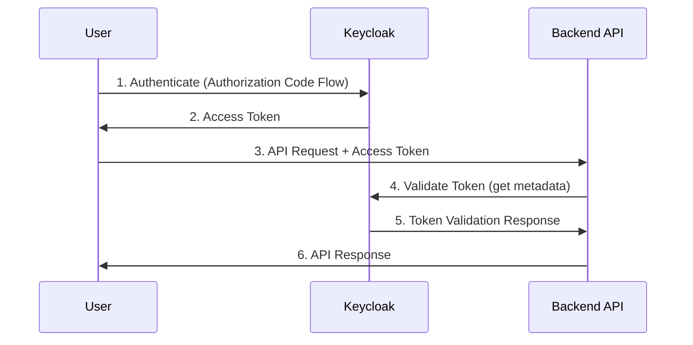

# Bring Your Own Identity (System)

<br>

## Modern Identity Management on Kubernetes

---
layout: 3-images

imageLeft: '/ybor.png'

imageTopRight: '/ybor.png'

imageBottomRight: '/ybor.jpg'

---

# What is Keycloak?

<v-clicks>

- **Open Source** identity and access management server
- **Free to use** - no licensing fees
- **Standards-based** - OpenID Connect, OAuth 2.0, SAML
- **Self-hosted** - full control over your data
- **Enterprise-ready** - used in production environments

</v-clicks>

<div class="absolute bottom-10 left-10">
  <span class="text-gray-400">https://www.keycloak.org</span>
</div>

---

# Key Features

<div class="grid grid-cols-2 gap-8">

<div>

## Authentication & Authorization
- Single Sign-On (SSO)
- Multi-factor Authentication
- User Federation
- Social Login Providers
- Authorization Server

</div>

<div>

## Management & Administration
- Admin Console
- Account Management
- User Self-Service
- Role-Based Access Control
- Custom Themes

</div>

</div>

---

# When to Use Keycloak

<v-clicks>

## ✅ **Choose Keycloak When:**
- Need full control over identity data
- Compliance requirements for data sovereignty
- Complex authentication flows
- Microservices architecture
- Budget constraints (free vs. paid solutions)

## 🤔 **Alternatives to Consider:**
- **Cloud Solutions:** Azure Entra ID, AWS Cognito, Auth0
- **Self-hosted:** ASP.NET Core Identity, Duende IdentityServer

</v-clicks>

---

# Microservices Authentication Flow



---

# Getting Started - Docker Setup

Quick setup using Docker:

```bash
docker run -p 8080:8080 \
  -e KEYCLOAK_ADMIN=admin \
  -e KEYCLOAK_ADMIN_PASSWORD=admin \
  quay.io/keycloak/keycloak:latest \
  start-dev
```

<v-clicks>

- **Port:** 8080 (default)
- **Admin UI:** http://localhost:8080
- **Development Mode:** `start-dev` (faster startup)
- **Production:** Use `start` with proper database configuration

</v-clicks>

---

# Core Concepts

<div class="grid grid-cols-2 gap-8">

<div>

## **Realm**
- Isolated space for users, roles, and clients
- Think of it as a "tenant"
- Don't use the master realm for applications

## **Users**
- Individual accounts in the system
- Can have attributes, roles, and credentials
- Unique ID for system integration

</div>

<div>

## **Clients**
- Applications that can request authentication
- **Public:** Web UIs (no client secret)
- **Confidential:** Backend APIs (with client secret)

## **Roles**
- Define permissions and access levels
- Can be realm-level or client-specific

</div>

</div>

---

# Authentication Flows

<div class="grid grid-cols-2 gap-8">

<div>

## **Authorization Code Flow**
- **Best for:** Web applications
- **Security:** Most secure
- **Process:** Redirect → Login → Code → Token

```
User → Keycloak → Redirect with Code
Code → Token Exchange → Access Token
```

</div>

<div>

## **Client Credentials Flow**
- **Best for:** Server-to-server communication
- **Security:** Confidential clients only
- **Process:** Client ID + Secret → Token

```
Client ID + Secret → Keycloak
Keycloak → Access Token
```

</div>

</div>

---

# Token Types

<v-clicks>

## **Access Token**
- **Purpose:** API authentication
- **Format:** JWT with user claims
- **Contains:** User ID, roles, email, custom attributes

## **ID Token**
- **Purpose:** User identity information
- **Format:** JWT with user profile data
- **OpenID Connect:** Standard compliant

## **Refresh Token**
- **Purpose:** Obtain new access tokens
- **Lifespan:** Longer than access tokens
- **Security:** Can be revoked

</v-clicks>

---

# Demo Overview

What we'll demonstrate:

<v-clicks>

1. **Setup Keycloak** using Docker
2. **Create a Custom Realm** (not using master realm)
3. **Create a User Account** with credentials
4. **Configure Clients** (public and confidential)
5. **Test Authentication** using Keycloak test app
6. **API Requests** using Postman
7. **Examine JWT Tokens** and their contents

</v-clicks>

<div class="absolute bottom-10 right-10">
  <span class="text-blue-400">🚀 Live Demo Time!</span>
</div>

---

# Production Considerations

<v-clicks>

## **Database Configuration**
- Don't use embedded H2 in production
- PostgreSQL, MySQL, or MariaDB recommended
- Configure connection pooling

## **Security & Performance**
- Use HTTPS in production
- Configure proper CORS settings
- Set up clustering for high availability
- Regular security updates

## **Monitoring & Backup**
- Set up logging and monitoring
- Regular database backups
- Health checks for containers

</v-clicks>

---

# Next Steps & Resources

<div class="grid grid-cols-2 gap-8">

<div>

## **Learn More**
- Official Keycloak Documentation
- Integration with ASP.NET Core
- Advanced authorization features
- Custom themes and extensions

## **Community**
- GitHub: keycloak/keycloak
- Stack Overflow: keycloak tag
- Community forums

</div>

<div>

## **What's Next?**
- Backend API integration
- Custom user attributes
- Role-based authorization
- Social login providers
- Multi-factor authentication

</div>

</div>

<div class="absolute bottom-10 left-10">
  <span class="text-gray-400">Thank you! Questions?</span>
</div>