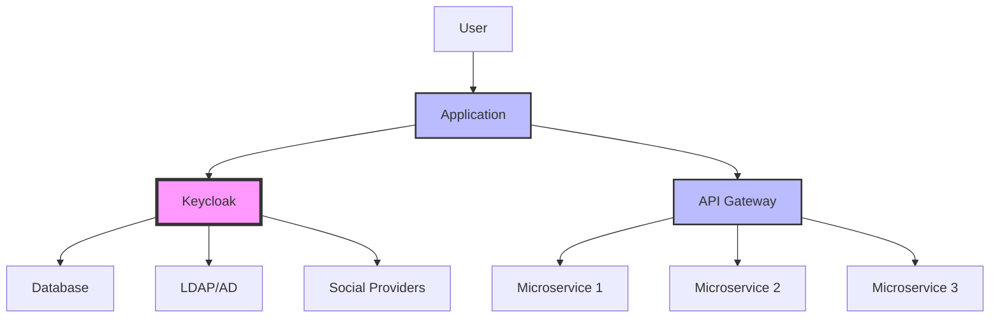
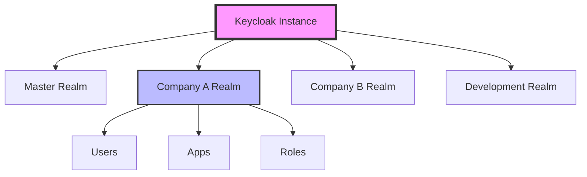
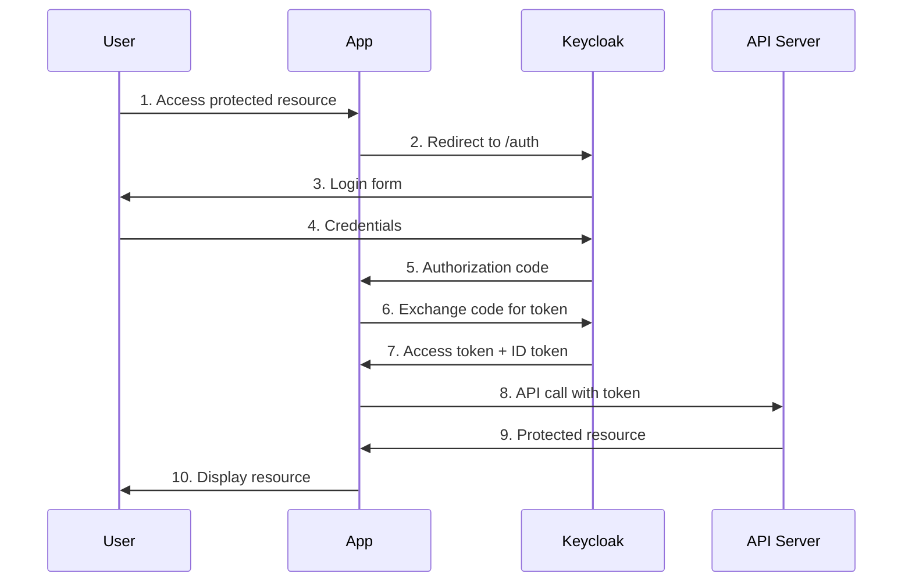

# Bring Your Own Identity (System)

<br>

## Modern Identity Management on Kubernetes

<!-- <div class="pt-12">
  <span @click="$slidev.nav.next" class="px-2 py-1 rounded cursor-pointer" hover="bg-white bg-opacity-10">
    Press Space for next page <carbon:arrow-right class="inline"/>
  </span>
</div> -->

<div class="abs-br m-6 flex gap-2">
  <button @click="$slidev.nav.openInEditor()" title="Open in Editor">
    <carbon:edit />
  </button>
  <a href="https://github.com/cmaenner/keycloak-getting-started" target="_blank" alt="GitHub" title="Open in GitHub"
    class="text-xl slidev-icon-btn opacity-50 !border-none !hover:text-white">
    <carbon-logo-github />
  </a>
</div>

---
transition: fade-out
---

# What is Keycloak?

Keycloak is an open-source identity and access management solution

<div grid="~ cols-2 gap-4">
<div>

## Core Features

- **Single Sign-On (SSO)** - One login for multiple applications
- **Identity Brokering and Social Login** - OpenID Connect, SAML 2.0, Microsoft Entra
- **User Federation** - LDAP, Active Directory, Relational Databaases
- **Authorization** - Role-based and fine-grained permissions
- **Standards Compliance** - OAuth 2.0, OpenID Connect, SAML 2.0

</div>
<div>

## Why Choose Keycloak?

✅ **Open Source** - No vendor lock-in  
✅ **Enterprise Ready** - High availability, clustering  
✅ **Developer Friendly** - REST APIs, SDKs  
✅ **Extensible** - Custom themes, plugins  
✅ **Cloud Native** - Container ready, Kubernetes native  

</div>
</div>

---

# My Experience with Keycloak

Real-world insights from production deployments

<div grid="~ cols-2 gap-8">
<div>

## Projects & Scale
- **Financial Services** - 50,000+ users
- **Healthcare Platform** - Multi-tenant SaaS
- **E-commerce** - Social login integration
- **Enterprise** - LDAP federation

## Key Learnings
- Start simple, scale gradually
- Proper realm design is crucial
- Monitor performance metrics
- Plan for high availability

</div>
<div>

## Common Challenges & Solutions

### Challenge: Complex User Flows
**Solution**: Custom authenticators and themes

### Challenge: Performance at Scale
**Solution**: Clustering and database optimization

### Challenge: Integration Complexity
**Solution**: Standard protocols (OIDC/SAML)

### Challenge: Security Concerns
**Solution**: Regular updates and security audits

</div>
</div>

---

# Keycloak as Identity Service

Modern identity architecture patterns



<div grid="~ cols-3 gap-4" class="mt-8">
<div>

## Traditional Auth
- Application handles auth
- User stores in each app
- No SSO capability
- Security complexity

</div>
<div>

## With Keycloak
- Centralized authentication
- Single user store
- SSO across applications
- Standardized security

</div>
<div>

## Benefits
- Reduced development time
- Consistent user experience
- Better security posture
- Easier compliance

</div>
</div>

---

# Running Keycloak with Docker

Local development setup

<div grid="~ cols-2 gap-4">
<div>

## Docker Compose Setup

```yaml
version: '3.8'
services:
  postgres:
    image: postgres:15
    environment:
      POSTGRES_DB: keycloak
      POSTGRES_USER: keycloak
      POSTGRES_PASSWORD: password
    ports:
      - 5432:5432
    volumes:
      - postgres_data:/var/lib/postgresql/data

  keycloak:
    image: quay.io/keycloak/keycloak:22.0
    command: start-dev
    environment:
      KC_HOSTNAME: localhost
      KC_DB: postgres
      KC_DB_URL: jdbc:postgresql://postgres/keycloak
      KC_DB_USERNAME: keycloak
      KC_DB_PASSWORD: password
      KEYCLOAK_ADMIN: admin
      KEYCLOAK_ADMIN_PASSWORD: admin
    ports:
      - 8080:8080
    depends_on:
      - postgres
```

</div>
<div>

## Quick Start Commands

```bash
# Start services
docker-compose up -d

# Check status
docker-compose ps

# View logs
docker-compose logs -f keycloak

# Stop services
docker-compose down

# Reset data
docker-compose down -v
```

## Kubernetes Alternative

```bash
# Our production setup
make presentation-ready-https

# Access points
# - Keycloak: https://keycloak.local
# - Admin: admin/admin
```

</div>
</div>

---

# Creating a Keycloak Realm

Realms are isolated environments for users and applications

<div grid="~ cols-2 gap-4">
<div>

## What is a Realm?

A realm manages a set of:
- **Users** and **Groups**
- **Roles** and **Permissions**  
- **Clients** (applications)
- **Authentication** flows
- **Security** policies

## Multi-tenant Architecture



</div>
<div>

## Creating a Realm

### Step 1: Admin Console
- Navigate to https://keycloak.local
- Login with admin credentials
- Hover over realm dropdown

### Step 2: Create Realm
```json
{
  "realm": "mycompany",
  "displayName": "My Company",
  "enabled": true,
  "registrationAllowed": true,
  "resetPasswordAllowed": true,
  "rememberMe": true,
  "loginWithEmailAllowed": true,
  "duplicateEmailsAllowed": false
}
```

### Step 3: Configure Settings
- Login settings
- Email settings  
- Password policies
- Themes and branding

</div>
</div>

---

# Creating Our First User

User management and registration flows

<div grid="~ cols-2 gap-4">
<div>

## Manual User Creation

### Via Admin Console
1. Select your realm
2. Go to **Users** → **Add user**
3. Fill required fields:
   - Username: `john.doe`
   - Email: `john@example.com`
   - First/Last Name
4. Set temporary password
5. Assign roles if needed

### Via REST API
```bash
# Get admin token
TOKEN=$(curl -s -X POST \
  "https://keycloak.local/auth/realms/master/protocol/openid-connect/token" \
  -H "Content-Type: application/x-www-form-urlencoded" \
  -d "username=admin&password=admin&grant_type=password&client_id=admin-cli" | jq -r '.access_token')

# Create user
curl -X POST \
  "https://keycloak.local/auth/admin/realms/mycompany/users" \
  -H "Authorization: Bearer $TOKEN" \
  -H "Content-Type: application/json" \
  -d '{
    "username": "john.doe",
    "email": "john@example.com",
    "firstName": "John",
    "lastName": "Doe",
    "enabled": true,
    "emailVerified": true
  }'
```

</div>
<div>

## User Registration Flow

### Self-Registration
- Enable in realm settings
- Customize registration form
- Email verification
- Password policies

### User Attributes
```json
{
  "username": "john.doe",
  "email": "john@example.com",
  "firstName": "John",
  "lastName": "Doe",
  "attributes": {
    "department": ["Engineering"],
    "location": ["San Francisco"],
    "employee_id": ["EMP001"]
  },
  "groups": ["/employees", "/developers"],
  "realmRoles": ["user"],
  "clientRoles": {
    "myapp": ["read", "write"]
  }
}
```

### Password Management
- Temporary passwords
- Password policies
- Reset flows
- MFA requirements

</div>
</div>

---

# Creating an OAuth Client

Configuring applications for authentication

<div grid="~ cols-2 gap-4">
<div>

## Public Client (Frontend Apps)

### Configuration
```json
{
  "clientId": "myapp-frontend",
  "name": "My App Frontend",
  "description": "React/Vue/Angular SPA",
  "enabled": true,
  "clientAuthenticatorType": "client-secret",
  "publicClient": true,
  "standardFlowEnabled": true,
  "directAccessGrantsEnabled": false,
  "serviceAccountsEnabled": false,
  "rootUrl": "https://myapp.com",
  "redirectUris": [
    "https://myapp.com/*",
    "http://localhost:3000/*"
  ],
  "webOrigins": [
    "https://myapp.com",
    "http://localhost:3000"
  ]
}
```

### Use Cases
- Single Page Applications (SPA)
- Mobile applications
- Desktop applications
- Cannot store secrets securely

</div>
<div>

## Confidential Client (Backend Apps)

### Configuration
```json
{
  "clientId": "myapp-backend",
  "name": "My App Backend",
  "description": "Node.js/Python/Java API",
  "enabled": true,
  "clientAuthenticatorType": "client-secret",
  "publicClient": false,
  "standardFlowEnabled": true,
  "directAccessGrantsEnabled": true,
  "serviceAccountsEnabled": true,
  "secret": "generated-secret-key",
  "redirectUris": [
    "https://api.myapp.com/auth/callback"
  ]
}
```

### Use Cases
- Backend APIs
- Server-side applications
- Service-to-service communication
- Can store secrets securely

</div>
</div>

---

# Demo: Authorization Code Flow

The most secure OAuth 2.0 flow for web applications

<div grid="~ cols-2 gap-4">
<div>

## Flow Diagram



## Key Benefits
- **Secure** - Tokens never exposed to browser
- **Standard** - OAuth 2.0 / OpenID Connect
- **Flexible** - Works with any client type
- **Scalable** - Stateless token validation

</div>
<div>

## Live Demo Steps

### 1. Setup Demo Client
```bash
# Access test environment
make test-runner-shell

# Create demo client
curl -X POST "$KEYCLOAK_URL/auth/admin/realms/mycompany/clients" \
  -H "Authorization: Bearer $TOKEN" \
  -H "Content-Type: application/json" \
  -d '{
    "clientId": "demo-app",
    "publicClient": true,
    "redirectUris": ["https://oauth.pstmn.io/v1/callback"]
  }'
```

### 2. Authorization Request
```
https://keycloak.local/auth/realms/mycompany/protocol/openid-connect/auth?
  client_id=demo-app&
  response_type=code&
  scope=openid profile email&
  redirect_uri=https://oauth.pstmn.io/v1/callback&
  state=random-state-value
```

### 3. Token Exchange
```bash
curl -X POST "$KEYCLOAK_URL/auth/realms/mycompany/protocol/openid-connect/token" \
  -H "Content-Type: application/x-www-form-urlencoded" \
  -d "grant_type=authorization_code&code=AUTH_CODE&client_id=demo-app&redirect_uri=https://oauth.pstmn.io/v1/callback"
```

</div>
</div>

---

# Creating a Confidential Client

Secure client configuration for backend services

<div grid="~ cols-2 gap-4">
<div>

## Configuration Steps

### 1. Client Settings
```json
{
  "clientId": "secure-backend",
  "name": "Secure Backend API",
  "enabled": true,
  "publicClient": false,
  "clientAuthenticatorType": "client-secret",
  "standardFlowEnabled": true,
  "serviceAccountsEnabled": true,
  "directAccessGrantsEnabled": true
}
```

### 2. Authentication
- **Client Secret**: Shared secret
- **JWT Assertion**: Signed JWT
- **mTLS**: Mutual TLS certificates
- **Private Key JWT**: Asymmetric keys

### 3. Service Account
```json
{
  "serviceAccountsEnabled": true,
  "serviceAccountRealmRoles": ["realm-admin"],
  "serviceAccountClientRoles": {
    "account": ["view-profile", "manage-account"]
  }
}
```

</div>
<div>

## Client Credentials Flow

### Use Cases
- API-to-API communication
- Background services
- Batch processing
- System integration

### Implementation
```bash
# Get service account token
curl -X POST \
  "$KEYCLOAK_URL/auth/realms/mycompany/protocol/openid-connect/token" \
  -H "Content-Type: application/x-www-form-urlencoded" \
  -d "grant_type=client_credentials&client_id=secure-backend&client_secret=CLIENT_SECRET"
```

### Response
```json
{
  "access_token": "eyJhbGciOiJSUzI1NiIsInR5cCI6IkpXVCJ9...",
  "expires_in": 300,
  "refresh_expires_in": 0,
  "token_type": "Bearer",
  "not-before-policy": 0,
  "scope": "profile email"
}
```

</div>
</div>

---

# Access Tokens & Refresh Tokens

Understanding JWT tokens and their lifecycle

<div grid="~ cols-2 gap-4">
<div>

## Access Token Structure

### JWT Header
```json
{
  "alg": "RS256",
  "typ": "JWT",
  "kid": "key-id"
}
```

### JWT Payload
```json
{
  "exp": 1672531200,
  "iat": 1672530300,
  "iss": "https://keycloak.local/auth/realms/mycompany",
  "aud": ["myapp", "account"],
  "sub": "user-uuid",
  "typ": "Bearer",
  "azp": "myapp-frontend",
  "session_state": "session-id",
  "scope": "openid profile email",
  "name": "John Doe",
  "preferred_username": "john.doe",
  "given_name": "John",
  "family_name": "Doe",
  "email": "john@example.com",
  "realm_access": {
    "roles": ["user", "admin"]
  },
  "resource_access": {
    "myapp": {
      "roles": ["read", "write"]
    }
  }
}
```

</div>
<div>

## Token Management

### Token Lifetimes
- **Access Token**: 5-15 minutes (short-lived)
- **Refresh Token**: 30 days (long-lived)
- **ID Token**: Same as access token
- **Session**: 30 minutes idle, 12 hours max

### Refresh Flow
```bash
# Refresh access token
curl -X POST \
  "$KEYCLOAK_URL/auth/realms/mycompany/protocol/openid-connect/token" \
  -H "Content-Type: application/x-www-form-urlencoded" \
  -d "grant_type=refresh_token&refresh_token=REFRESH_TOKEN&client_id=myapp-frontend"
```

### Token Validation
```bash
# Introspect token
curl -X POST \
  "$KEYCLOAK_URL/auth/realms/mycompany/protocol/openid-connect/token/introspect" \
  -H "Content-Type: application/x-www-form-urlencoded" \
  -d "token=ACCESS_TOKEN&client_id=myapp-frontend&client_secret=CLIENT_SECRET"
```

### Best Practices
- Store refresh tokens securely
- Implement token rotation
- Use short access token lifetimes
- Validate tokens on each request

</div>
</div>

---

# Keycloak Admin Console Tour

Exploring the administrative interface

<div grid="~ cols-2 gap-4">
<div>

## Main Navigation

### Realm Management
- **Realm Settings** - Basic configuration
- **Login** - Authentication settings
- **Keys** - Cryptographic keys
- **Email** - SMTP configuration
- **Themes** - UI customization
- **Localization** - Multi-language support

### User Management
- **Users** - User accounts
- **Groups** - User groups
- **Roles** - Realm and client roles
- **Sessions** - Active sessions
- **Events** - Audit logs

### Application Management
- **Clients** - Applications
- **Client Scopes** - Permission scopes
- **Mappers** - Token mappers

</div>
<div>

## Security Features

### Authentication
- **Authentication** - Login flows
- **Password Policy** - Strength requirements
- **OTP Policy** - Two-factor auth
- **WebAuthn** - Passwordless auth

### Authorization
- **Authorization** - Fine-grained permissions
- **Policies** - Access control rules
- **Permissions** - Resource access
- **Evaluation** - Policy testing

### Integration
- **Identity Providers** - External auth
- **User Federation** - LDAP/AD
- **Import/Export** - Configuration backup

## Demo Navigation
Let's explore the admin console live!

</div>
</div>

---

# Public and Confidential Clients

Understanding OAuth 2.0 client types

<div grid="~ cols-3 gap-4">
<div>

## Public Clients

### Characteristics
- Cannot store secrets
- Code can be inspected
- PKCE required
- Frontend applications

### Examples
- Single Page Apps (React, Vue, Angular)
- Mobile apps (iOS, Android)
- Desktop applications
- CLI tools

### Security Considerations
- Use PKCE for authorization code flow
- Short token lifetimes
- No client authentication
- Secure redirect URIs

</div>
<div>

## Confidential Clients

### Characteristics
- Can store secrets securely
- Server-side execution
- Client authentication
- Backend applications

### Examples
- Web servers (Node.js, Python, Java)
- API gateways
- Microservices
- Background services

### Security Considerations
- Client secret authentication
- JWT assertion
- mTLS authentication
- Service accounts

</div>
<div>

## Configuration Comparison

### Public Client
```json
{
  "clientId": "spa-app",
  "publicClient": true,
  "standardFlowEnabled": true,
  "implicitFlowEnabled": false,
  "directAccessGrantsEnabled": false,
  "serviceAccountsEnabled": false,
  "redirectUris": ["https://app.com/*"],
  "webOrigins": ["https://app.com"]
}
```

### Confidential Client
```json
{
  "clientId": "backend-api",
  "publicClient": false,
  "clientAuthenticatorType": "client-secret",
  "secret": "generated-secret",
  "standardFlowEnabled": true,
  "serviceAccountsEnabled": true,
  "directAccessGrantsEnabled": true
}
```

</div>
</div>

---

# Getting a JWT from Keycloak

Practical token acquisition methods

<div grid="~ cols-2 gap-4">
<div>

## Method 1: Authorization Code Flow

### Step 1: Authorization Request
```javascript
const authUrl = `${keycloakUrl}/auth/realms/${realm}/protocol/openid-connect/auth`;
const params = new URLSearchParams({
  client_id: 'myapp',
  response_type: 'code',
  scope: 'openid profile email',
  redirect_uri: 'https://myapp.com/callback',
  state: generateRandomState()
});

window.location.href = `${authUrl}?${params}`;
```

### Step 2: Token Exchange
```javascript
const tokenResponse = await fetch(`${keycloakUrl}/auth/realms/${realm}/protocol/openid-connect/token`, {
  method: 'POST',
  headers: {
    'Content-Type': 'application/x-www-form-urlencoded',
  },
  body: new URLSearchParams({
    grant_type: 'authorization_code',
    code: authorizationCode,
    client_id: 'myapp',
    redirect_uri: 'https://myapp.com/callback'
  })
});

const tokens = await tokenResponse.json();
```

</div>
<div>

## Method 2: Direct Grant (Password)

### For Testing Only
```bash
curl -X POST \
  "$KEYCLOAK_URL/auth/realms/mycompany/protocol/openid-connect/token" \
  -H "Content-Type: application/x-www-form-urlencoded" \
  -d "grant_type=password" \
  -d "username=john.doe" \
  -d "password=secret123" \
  -d "client_id=myapp"
```

## Method 3: Client Credentials

### For Service Accounts
```bash
curl -X POST \
  "$KEYCLOAK_URL/auth/realms/mycompany/protocol/openid-connect/token" \
  -H "Content-Type: application/x-www-form-urlencoded" \
  -d "grant_type=client_credentials" \
  -d "client_id=backend-service" \
  -d "client_secret=CLIENT_SECRET"
```

## JWT Decoding
```javascript
function decodeJWT(token) {
  const parts = token.split('.');
  const payload = JSON.parse(atob(parts[1]));
  return payload;
}

const claims = decodeJWT(accessToken);
console.log('User:', claims.preferred_username);
console.log('Roles:', claims.realm_access.roles);
```

</div>
</div>

---

# Live Demo: Complete Flow

Let's see everything in action!

<div grid="~ cols-2 gap-4">
<div>

## Demo Environment

### Kubernetes Setup
```bash
# Our production-like setup
make presentation-ready-https

# Deploy test tools
make deploy-test-runner

# Connect to test environment
make test-runner-shell
```

### Available Services
- **Keycloak**: https://keycloak.local
- **Admin Console**: admin/admin
- **Test Pod**: Pre-configured with scripts
- **API Testing**: Ready-to-use commands

## Demo Steps
1. **Admin Console Tour**
2. **Create Realm & User**
3. **Configure Client**
4. **Authorization Code Flow**
5. **JWT Analysis**
6. **API Testing**

</div>
<div>

## Test Commands

### Get Admin Token
```bash
TOKEN=$(curl -s -X POST \
  "$KEYCLOAK_URL/auth/realms/master/protocol/openid-connect/token" \
  -H "Content-Type: application/x-www-form-urlencoded" \
  -d "username=admin&password=admin&grant_type=password&client_id=admin-cli" | jq -r '.access_token')
```

### Create Test User
```bash
curl -X POST \
  "$KEYCLOAK_URL/auth/admin/realms/master/users" \
  -H "Authorization: Bearer $TOKEN" \
  -H "Content-Type: application/json" \
  -d '{"username": "demo-user", "email": "demo@example.com", "enabled": true}'
```

### Test Authentication
```bash
curl -X POST \
  "$KEYCLOAK_URL/auth/realms/master/protocol/openid-connect/token" \
  -H "Content-Type: application/x-www-form-urlencoded" \
  -d "grant_type=password&username=demo-user&password=demo123&client_id=admin-cli"
```

### Decode JWT
```bash
echo "ACCESS_TOKEN" | cut -d'.' -f2 | base64 -d | jq
```

</div>
</div>

---

# Production Considerations

Scaling Keycloak for enterprise use

<div grid="~ cols-2 gap-4">
<div>

## High Availability

### Database Clustering
- PostgreSQL with replication
- MySQL/MariaDB cluster
- External database services

### Keycloak Clustering
```yaml
apiVersion: apps/v1
kind: Deployment
metadata:
  name: keycloak
spec:
  replicas: 3
  template:
    spec:
      containers:
      - name: keycloak
        image: quay.io/keycloak/keycloak:22.0
        env:
        - name: KC_CACHE_STACK
          value: kubernetes
        - name: JGROUPS_DISCOVERY_PROTOCOL
          value: dns.DNS_PING
```

### Load Balancing
- Session affinity
- Health checks
- SSL termination

</div>
<div>

## Security Hardening

### Network Security
- Private subnets
- WAF protection
- DDoS mitigation
- Network policies

### Authentication Security
- Strong password policies
- Multi-factor authentication
- Account lockout policies
- Session management

### Monitoring & Alerting
```yaml
apiVersion: v1
kind: ConfigMap
metadata:
  name: keycloak-monitoring
data:
  prometheus.yml: |
    global:
      scrape_interval: 15s
    scrape_configs:
    - job_name: 'keycloak'
      static_configs:
      - targets: ['keycloak:9990']
```

### Backup & Recovery
- Database backups
- Configuration exports
- Disaster recovery procedures

</div>
</div>

---

# Resources & Next Steps

Continue your Keycloak journey

<div grid="~ cols-3 gap-4">
<div>

## Official Resources

### Documentation
- [Keycloak Docs](https://www.keycloak.org/documentation)
- [Admin Guide](https://www.keycloak.org/docs/latest/server_admin/)
- [Developer Guide](https://www.keycloak.org/docs/latest/server_development/)

### Community
- [Keycloak Discourse](https://keycloak.discourse.group/)
- [GitHub Issues](https://github.com/keycloak/keycloak/issues)
- [Stack Overflow](https://stackoverflow.com/questions/tagged/keycloak)

</div>
<div>

## Learning Path

### Next Steps
1. **Advanced Configuration**
   - Custom themes
   - User federation
   - Social login providers

2. **Integration Patterns**
   - API gateways
   - Microservices
   - Legacy applications

3. **Operations**
   - Monitoring setup
   - Backup strategies
   - Performance tuning

</div>
<div>

## Demo Environment

### Repository
```bash
git clone https://github.com/yourusername/keycloak-presentation
cd keycloak-presentation
make presentation-ready-https
```

### Try It Yourself
- Complete Kubernetes setup
- Production-ready configuration
- Test scripts included
- Documentation provided

### Contact
- **GitHub**: @yourusername
- **Email**: your.email@example.com
- **LinkedIn**: /in/yourprofile

</div>
</div>

---
layout: center
class: text-center
---

# Thank You!

## Questions & Discussion

<div class="pt-12">
  <span class="px-2 py-1 rounded cursor-pointer" hover="bg-white bg-opacity-10">
    Let's discuss your Keycloak use cases!
  </span>
</div>

<div class="abs-br m-6 flex gap-2">
  <a href="https://github.com/yourusername/keycloak-presentation" target="_blank" alt="GitHub" title="Demo Repository"
    class="text-xl slidev-icon-btn opacity-50 !border-none !hover:text-white">
    <carbon-logo-github />
  </a>
</div>

---

# Appendix: Common Commands

Quick reference for your demo environment

<div grid="~ cols-2 gap-4">
<div>

## Environment Setup
```bash
# Complete setup
make presentation-ready-https

# Individual components
make create-cluster
make install-crossplane
make deploy-keycloak-https
make setup-https-hosts

# Testing
make deploy-test-runner
make run-all-tests
make test-runner-shell
```

## Database Access
```bash
# PostgreSQL connection
make postgres-connect

# pgAdmin web interface
make deploy-pgadmin
# Access: http://pgadmin.local

# Database backup
make postgres-backup
```

</div>
<div>

## API Testing
```bash
# Quick connectivity test
make test-keycloak-api

# HTTPS testing
make test-keycloak-https

# Advanced testing
make advanced-test-shell

# Performance testing
make run-performance-tests
```

## Troubleshooting
```bash
# System status
make status

# Logs
make logs
make postgres-logs

# Troubleshooting
make troubleshoot

# Cleanup
make cleanup-all
```

</div>
</div>